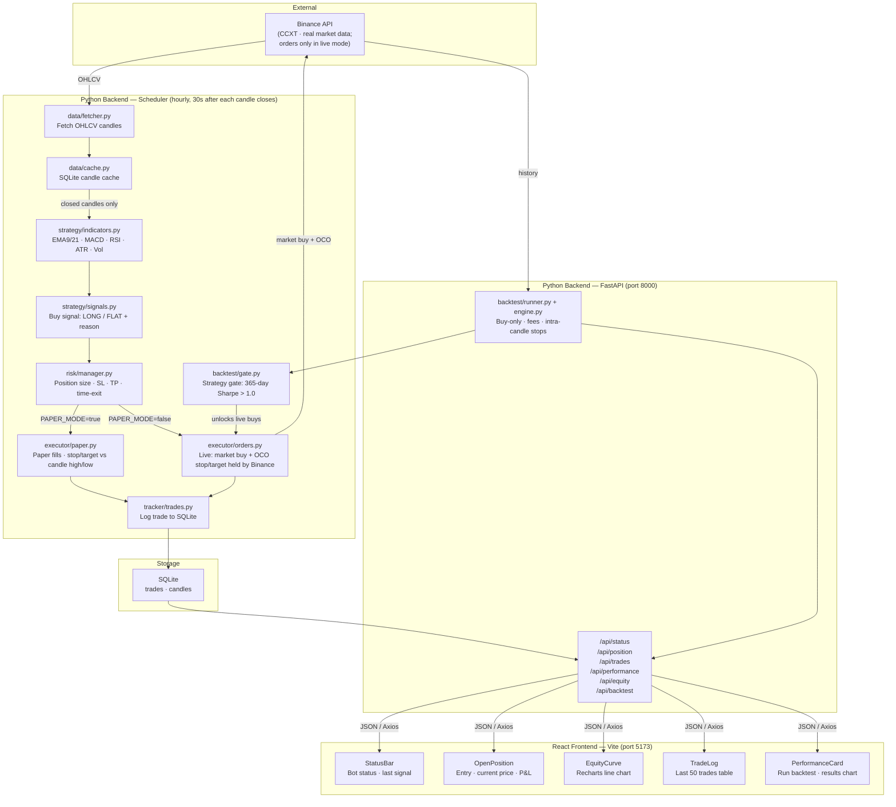

# TradBot — Complete Implementation Plan

## Context

Build a personal, locally-hosted automated crypto trading bot for a **complete trading beginner** that:
- Trades **BTC/USDT on Binance spot, buy-only**, with no human intervention
- End goal: **live trading on the user's real Binance account**, within a USDT cap the user sets (Phase 9: built, unlocks when a strategy passes the gate)
- Holds positions for a **maximum of 24 hours** (intraday swing)
- Uses **pure technical indicators** — transparent, no ML, no external data needed (Phase 1–8)
- ML integration is planned as a separate future phase (Phase 10+)
- Exposes a **local web dashboard** (user checks it manually, no push alerts)
- Starts in **paper trading mode** (real market data, simulated fills) — zero real money until the user is confident
- All historical data for backtesting is fetched **free from Binance's own API**
- A `CONTEXT.md` in the project root keeps full project context for LLM handoffs

---

## Architecture Diagram

> **Keep this up to date.** Every time a new module or layer is added, update this diagram before marking the phase complete.



---

## Strategy Decision (owner: Claude — newbie-safe)

**Why pure technical indicators (no ML for now):**
- Complete beginner → every trade must be explainable: "the bot bought because X happened"
- No training data needed and no model to maintain
- Easy to tune: changing one number changes one behaviour
- Caveat: no simple indicator rule tested in this project has shown an edge after fees (see Phase 8)

**Market:** Binance spot, **buy-only**. Spot can't sell BTC the account doesn't hold, so there are no short trades.

**Buy signal (all 4 must agree, judged on the last closed hourly candle):**

| # | Indicator | Rule | What it catches |
|---|---|---|---|
| 1 | EMA 9 / EMA 21 | EMA9 crosses above EMA21 | Trend turning up |
| 2 | RSI (14) | RSI < 65 | Avoids buying at exhaustion peaks |
| 3 | MACD (12/26/9) | Histogram positive | Momentum confirmation |
| 4 | Volume | Candle volume ≥ 1.5× 20-period average | Ensures real move, not a fake-out |

**Exit rules (whichever hits first):**
- **Stop-loss:** 1.5× ATR(14) below entry, filled as soon as a candle touches it (like a resting exchange order)
- **Take-profit:** 2.5× ATR(14) above entry, same; if one candle touches both, the stop is assumed to fill first
- **Hard time-exit:** sell at the 23rd hourly check regardless of P&L (max 1 day rule)

**Costs:** Binance spot fee of 0.1% per side (`FEE_PCT`), included in the backtest and in paper P&L.

**Position sizing:**
- Risk 2% of portfolio per trade (fixed-fraction), capped at 95% of the portfolio per position
- Max 1 open trade at any time

---

## Tech Stack

| Layer | Technology | Purpose |
|---|---|---|
| Language | Python 3.11 | Main runtime |
| Exchange | CCXT (Binance) | Unified exchange API; public market data (orders only in live mode) |
| Indicators | pandas-ta | EMA, MACD, RSI, ATR, Volume MA — one-line calls |
| Scheduler | APScheduler | Run signal check each hour, 30s after the candle closes |
| Database | SQLite (via SQLAlchemy) | Candle cache, trade log, P&L history |
| Backend API | FastAPI (Python) | REST JSON API at http://localhost:8000 |
| Frontend | React (Vite) | Dashboard UI at http://localhost:5173 |
| Charts | Recharts (React lib) | Equity curve, candle/price charts |
| HTTP client | Axios | React → FastAPI data fetching |
| Config | python-dotenv | Keep API keys in .env, out of code |

No ML libraries needed in Phase 1–7. No external data files needed.

**Architecture note:** FastAPI is a pure REST API (returns JSON only, no HTML). React is a standalone Vite app that fetches from FastAPI. Both run locally; CORS is enabled on FastAPI for localhost:5173.

---

## Project Structure

```
TradBot/                     # repo root
├── PLAN.md                  # ← Full implementation plan (this document)
├── CONTEXT.md               # ← LLM handoff doc
├── .gitignore
│
├── backend/                 # All Python code — run from inside this folder
│   ├── config/
│   │   └── settings.py      # All tunable params (thresholds, pairs, risk %)
│   ├── data/
│   │   ├── fetcher.py       # CCXT OHLCV fetch from Binance + closed_candles() filter
│   │   └── cache.py         # SQLite candle store — upsert refreshes half-finished candles
│   ├── strategy/
│   │   ├── indicators.py    # Compute EMA9/21, MACD, RSI14, ATR14, VolMA20
│   │   └── signals.py       # Combine 4 indicators → LONG / FLAT (buy-only)
│   ├── risk/
│   │   └── manager.py       # Position size, SL/TP prices, time-exit logic
│   ├── executor/
│   │   ├── orders.py        # Live: market buy within the cap + OCO stop/target held by Binance
│   │   └── paper.py         # Paper engine: simulate fills when PAPER_MODE=true
│   ├── tracker/
│   │   ├── trades.py        # SQLAlchemy Trade model — log every trade
│   │   └── performance.py   # Win rate, total P&L, Sharpe ratio
│   ├── dashboard/
│   │   └── app.py           # FastAPI REST API routes (JSON only)
│   ├── backtest/
│   │   ├── engine.py        # Buy-only simulation: fees, intra-candle stops, daily Sharpe
│   │   ├── gate.py          # Strategy gate that locks live buys (365-day Sharpe > 1.0)
│   │   └── runner.py        # Fetch Binance history + run the engine for /api/backtest
│   ├── scheduler.py         # APScheduler: run full pipeline every 1h
│   ├── main.py              # Entry point: start scheduler + FastAPI together (live preflight)
│   ├── check_live.py        # Read-only live-trading readiness check (user runs it)
│   ├── tests/               # live_sim.py: live-trading scenarios on a simulated Binance
│   ├── requirements.txt
│   └── .env.example
│
└── frontend/                # React app (Vite) — run from inside this folder
    ├── src/
    │   ├── components/
    │   │   ├── StatusBar.jsx
    │   │   ├── OpenPosition.jsx
    │   │   ├── EquityCurve.jsx
    │   │   ├── TradeLog.jsx
    │   │   └── PerformanceCard.jsx
    │   ├── api/
    │   │   └── client.js
    │   ├── App.jsx
    │   └── main.jsx
    ├── index.html
    ├── package.json
    └── vite.config.js
```

---

## Configuration

**.env (never committed; optional in paper mode, see `backend/.env.example`):**
```
PAPER_MODE=true
BINANCE_API_KEY=   # live mode only
BINANCE_SECRET=    # live mode only
```

**config/settings.py:**
```python
SYMBOL        = "BTC/USDT"
TIMEFRAME     = "1h"
EMA_FAST      = 9
EMA_SLOW      = 21
RSI_PERIOD    = 14
RSI_LONG_MAX  = 65
MACD_FAST     = 12
MACD_SLOW     = 26
MACD_SIGNAL   = 9
ATR_PERIOD    = 14
VOL_MA_PERIOD = 20
VOL_MULT      = 1.5
SL_ATR_MULT   = 1.5
TP_ATR_MULT   = 2.5
RISK_PCT      = 2.0
MAX_HOLD_HRS  = 23
FEE_PCT       = 0.1
DASHBOARD_PORT= 8000
```

---

## Build Phases

### Phase 1 — Project Scaffold + Binance Connection ✅
- All directories and skeleton files created
- PLAN.md and CONTEXT.md written to project root
- requirements.txt and frontend/package.json defined
- .env.example and .gitignore created
- data/fetcher.py: CCXT Binance init (keyless public market data in paper mode), fetch last 200 1h candles
- config/settings.py: all strategy params

### Phase 2 — Candle Cache + Indicators ✅
- `data/cache.py`: SQLite candle table; upsert refreshes candles saved while still forming
- `strategy/indicators.py`: EMA9/21, MACD hist, RSI14, ATR14, VolMA20 via pandas-ta

### Phase 3 — Signal Engine ✅
- `strategy/signals.py`: EMA crossover + RSI + MACD + Volume → Signal(direction, reason)

### Phase 4 — Risk Manager + Executor ✅
- `risk/manager.py`: size_position, stop_loss_price, take_profit_price, should_time_exit
- `executor/paper.py`: simulate fills in paper mode
- `executor/orders.py`: real CCXT orders (PAPER_MODE=false only)
- `tracker/trades.py`: SQLAlchemy Trade model

### Phase 5 — Scheduler (Main Loop) ✅
- `scheduler.py`: APScheduler job at hh:00:30 UTC — fetch → closed candles → indicators → signal → risk → execute → log
- `main.py`: start scheduler + FastAPI uvicorn together

### Phase 6 — Dashboard (React + FastAPI) ✅
- `dashboard/app.py`: FastAPI with CORS, JSON endpoints
- `frontend/`: React Vite app with StatusBar, OpenPosition, EquityCurve, TradeLog, PerformanceCard

### Phase 7 — Backtesting ✅
- `backtest/runner.py`: fetch Binance history, replay the strategy, compute Sharpe
- Gate: Sharpe > 1.0 before any live trading

### Phase 8 — Strategy rework: spot buy-only, fees included ✅ (gate not passed)
- `backtest/engine.py`: buy-only simulation with a 0.1% fee per side, stop/target filled inside the candle (stop first if both touch), daily-return Sharpe (×√365), buy-and-hold comparison
- Paper trading uses the same exit rule and fee-inclusive P&L; `long_entries()` and `generate_signal()` agree candle for candle (checked on 4,000 real candles)
- Protocol: 4 years of BTC/USDT candles (2022-09 → 2026-09). Settings chosen on 2022-09-20 → 2025-03-19, then tested once on unseen 2025-03-20 → 2026-09-19. Gate: unseen Sharpe > 1.0 with ≥ 20 trades
- Results (2026-09-19): 0 of 49 hourly and 0 of 49 four-hour variants passed (EMA cross + trend filter, breakout + trend, dip in uptrend)
  - Current rules on the unseen period: 0% before fees, −10.1% after. Best hourly variant: +18.4% before fees, −14.0% after
  - Four-hour breakouts reached Sharpe 1.52 on the tuning period (BTC +344%) and lost money on unseen data
- Kept the current 4 rules, since no variant did better on unseen data; the bot stays in paper mode

### Phase 9 — Live trading on Binance spot ✅ built, locked until a strategy passes the gate
- The user puts their real API key and secret plus `MAX_CAPITAL_USDT` in `backend/.env` (key: Spot & Margin Trading on, withdrawals off); never pasted into chat or committed
- `executor/orders.py`: market buy sized from min(`MAX_CAPITAL_USDT`, free USDT) with the same 2% risk rule, then at once an OCO sell held by Binance: LIMIT_MAKER take-profit above, STOP_LOSS (market) stop below (STOP_LOSS_LIMIT fallback). The position stays protected while the PC is off
- Sells the BTC actually received (the buy fee comes out of the BTC unless paid in BNB); lot size, price tick and the 5 USDT minimum are respected; P&L comes from real fills and fees
- Hourly check records OCO fills and sells at market whatever has no working stop: OCO rejected, target only partly filled, orders cancelled on Binance, or a crash between buy and OCO. It also makes the 23-hour exit (cancel the pair, then sell); a fill that races the cancel is recorded as that fill
- `backtest/gate.py`: live buys need a 365-day backtest (fees included) with Sharpe > 1.0 over ≥ 20 trades. `main.py` won't start live otherwise; the gate is re-checked daily at 00:05 UTC, and a failing check pauses new buys while open trades are still managed
- `main.py` live preflight, in order: cap set, keys set, gate passed, account can trade. No signed request is made while the gate fails
- `check_live.py`: read-only readiness check the user runs (keys, account, key permissions, OCO support, a validated-but-not-executed test buy, the gate). It never places an order or prints keys
- Trades carry `mode` (paper/live), `entry_cost` and Binance order ids; `init_db()` adds these columns to existing databases. The dashboard and stats show only the running mode's trades
- Market data loads spot only (`fetchMarkets` spot, `fetchMargins` off), so loading markets needs no signed request
- Tested against a simulated Binance (real market rules, faked order endpoints) across 16 scenarios: `python backend/tests/live_sim.py`. Never run against the real account
- State on 2026-09-19: gate locked (365-day Sharpe −0.39 over 42 trades), so the bot keeps paper trading

---

## Future Phase: ML Integration (Phase 10+)

> Do not build until live trading (Phase 9) is settled and 2+ weeks of paper trade data are collected.

- **Model:** GradientBoostingClassifier (scikit-learn)
- **Features:** indicator values at signal time
- **Label:** 1 if price moved ≥1.5% in signal direction within 12h
- **Data:** fetched free from Binance API (no external files needed)
- **Threshold:** confidence ≥ 0.65 to take trade
- **New files:** `strategy/ml_scorer.py`, `models/scorer_v1.pkl`
- **Integration:** final gate in `signals.py` after indicator rules pass

---

## Verification Checklist

1. `cd backend && pip install -r requirements.txt` completes
2. `cd backend && python main.py` → FastAPI at localhost:8000
3. `cd frontend && npm run dev` → React at localhost:5173
4. Fetcher returns valid candles from Binance (real market data)
5. Indicators compute on 200-candle window with no NaN in last row
6. Signal returns a Signal object with non-empty reason string
7. Paper LONG → logged in SQLite → visible in dashboard
8. Time-exit fires at the 23rd hourly check in paper mode
9. Backtest on 1y completes; equity curve shown
10. Backtest and paper P&L are buy-only and include fees; a candle touching the stop or target closes the trade at that price
11. With `PAPER_MODE=false`, `python backend/main.py` refuses to start unless the cap, keys, strategy gate and account all pass
12. `python backend/check_live.py` reports readiness without placing any order
10. `.env` is gitignored; CONTEXT.md is up to date
