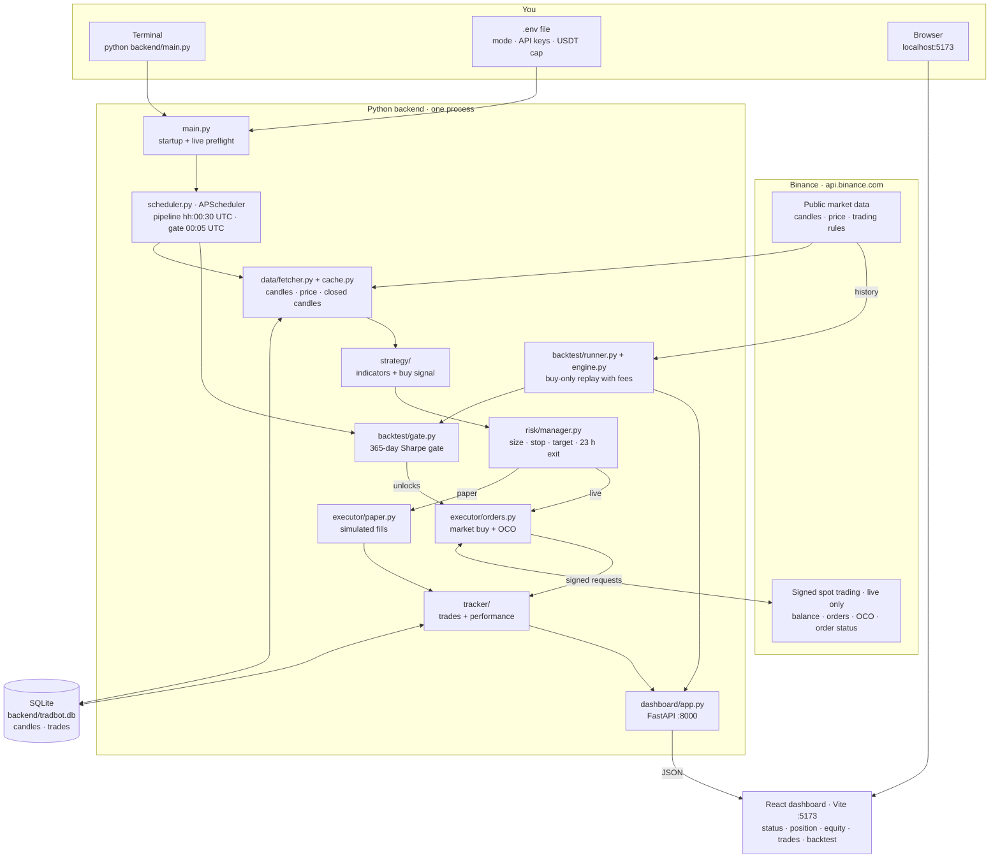
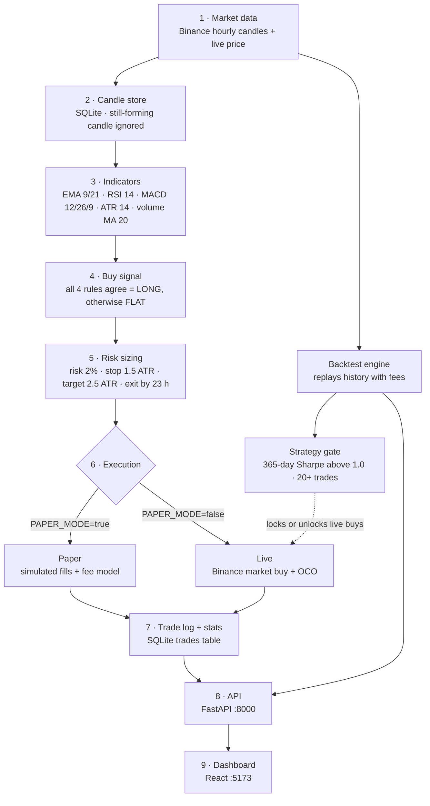
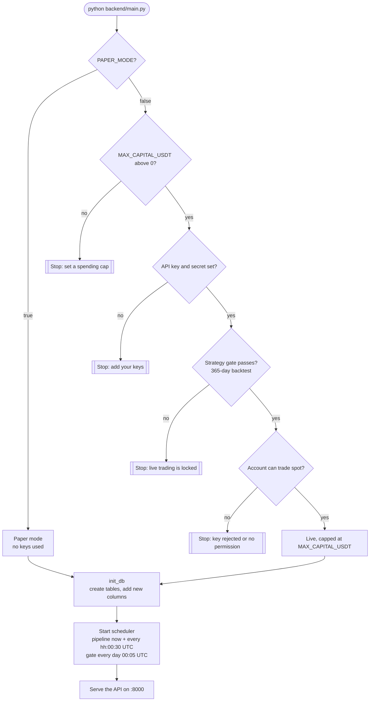
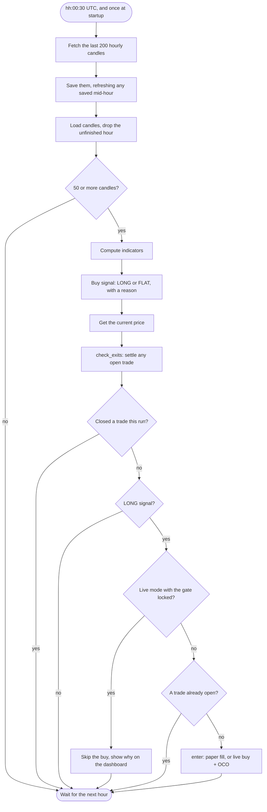
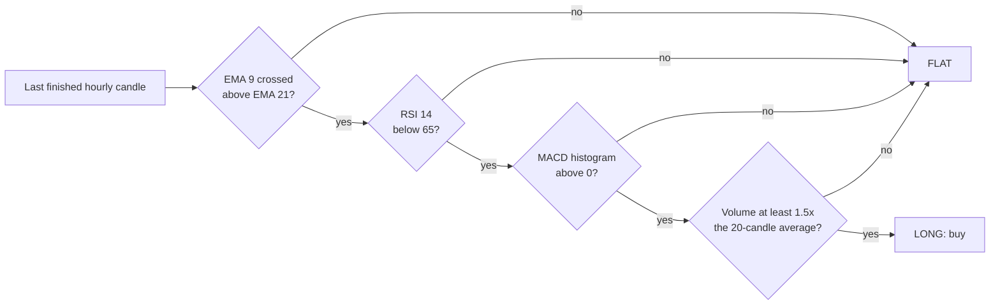
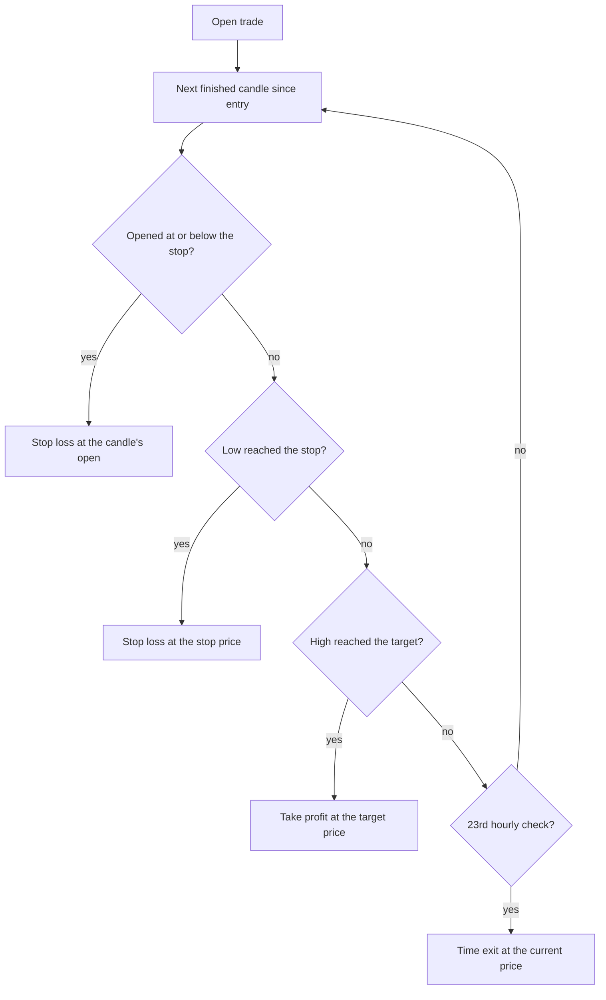
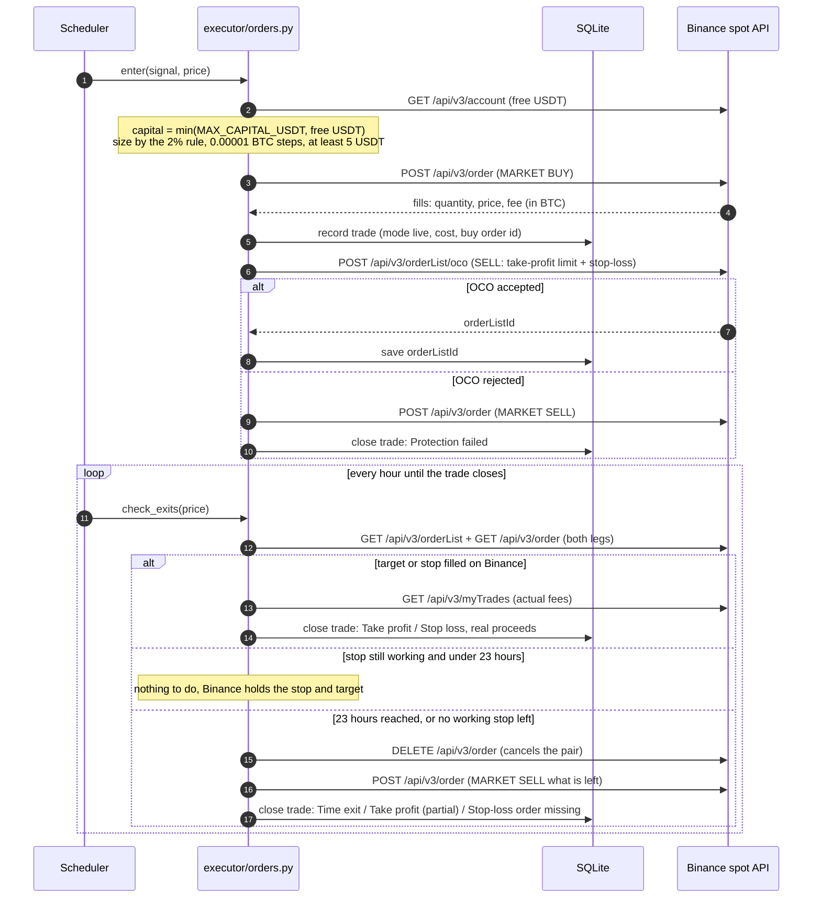
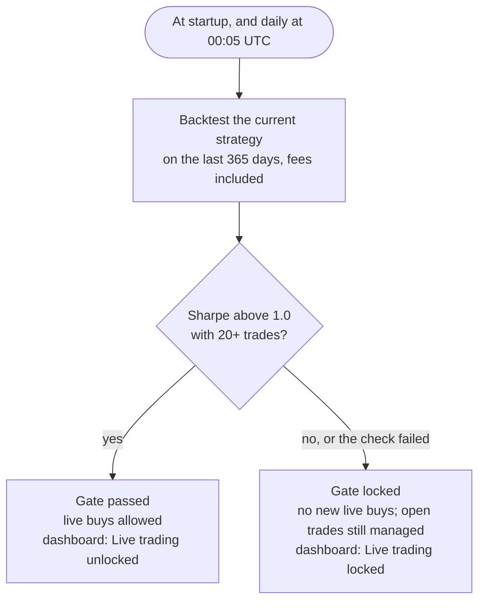
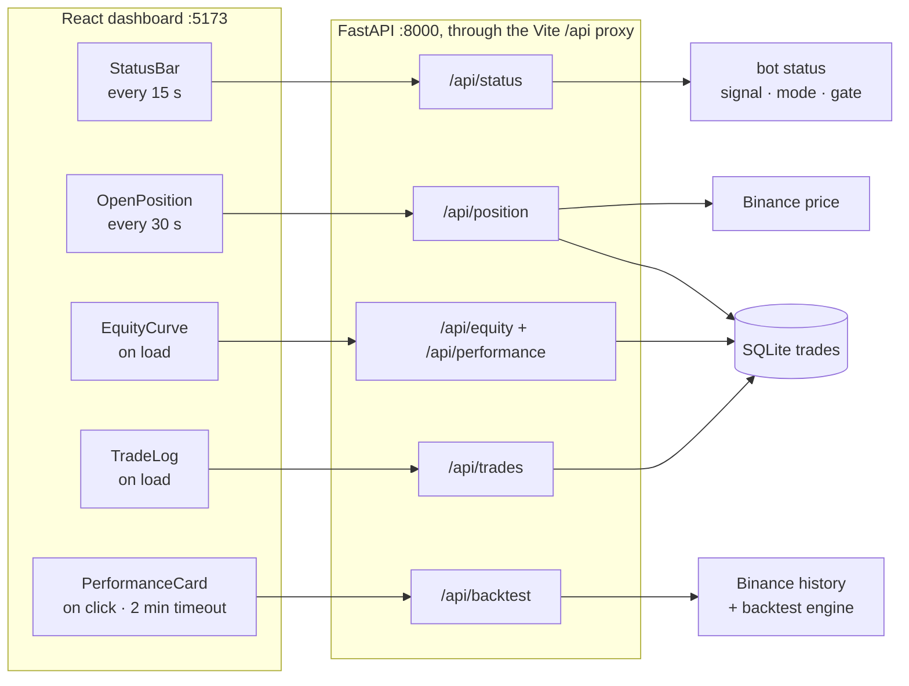
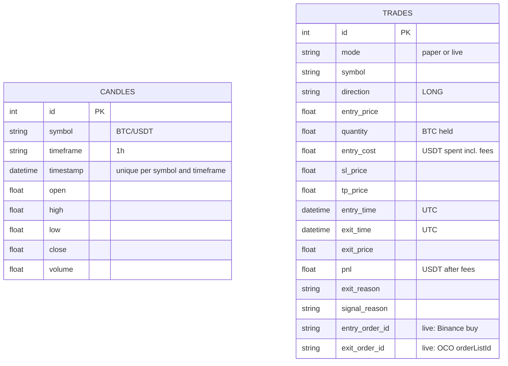

# TradBot — Architecture, Flows & Environment

**Automated BTC/USDT trading bot for Binance spot.** Buy-only, one trade at a time, every trade closed within 23 hours. Runs on your own PC.

Status on 2026-09-19: **paper trading**. Live trading on your real Binance account is built but **locked** until the strategy passes its gate (the 365-day Sharpe ratio is −0.39; it needs to be above 1.0).

Repository: https://github.com/joshdevusecase-hue/TradBot · PDF copy: `docs/ARCHITECTURE.pdf`

---

## 1. At a glance

| | |
|---|---|
| Market | Binance spot, BTC/USDT, hourly candles |
| Direction | Buy-only (spot can't sell BTC the account doesn't hold) |
| Decision | 4 indicator rules must all agree: EMA 9/21 crossover, RSI below 65, MACD histogram positive, volume spike |
| Exits | Stop-loss 1.5 × ATR below entry, take-profit 2.5 × ATR above, forced exit at 23 hours |
| Sizing | Risk 2% of capital per trade, at most 95% of capital in one position, max 1 open trade |
| Costs | 0.1% Binance fee on every buy and sell, counted everywhere |
| Paper mode (default) | Real market data, simulated fills, no keys needed |
| Live mode | Real orders on your account, capped at `MAX_CAPITAL_USDT`, protected by stop orders held on Binance, locked until the strategy gate passes |
| Runs as | One Python process (scheduler + API) + a React dashboard + one SQLite file |

---

## 2. System architecture

Everything runs on your PC except Binance. The backend is a single Python process: a scheduler runs the trading pipeline every hour, and a web API serves the dashboard.



| Zone | What lives there |
|---|---|
| You | The terminal that runs the bot, the `backend/.env` file with your settings, and the browser showing the dashboard |
| Binance | Public data (no account needed) for candles and prices; signed trading endpoints, used only in live mode with your API key |
| Python backend | Startup checks, the hourly scheduler, the trading pipeline, both executors, the backtester and gate, trade tracking, and the web API |
| SQLite | One file, `backend/tradbot.db`, holding cached candles and every trade (paper and live kept apart) |
| Dashboard | A React page that reads the API; it never trades and doesn't need to be open for the bot to work |

---

## 3. Block diagram

The trading path is a chain of nine stages. The backtest engine and the strategy gate sit beside it and decide whether live buys are allowed.



| Stage | Module | Job |
|---|---|---|
| 1 Market data | `data/fetcher.py` | Downloads the last 200 hourly candles and the current price from Binance's public API |
| 2 Candle store | `data/cache.py` | Saves candles in SQLite, refreshing any saved while still forming; `closed_candles()` drops the unfinished hour |
| 3 Indicators | `strategy/indicators.py` | Adds EMA 9 and 21, MACD histogram, RSI 14, ATR 14 and the 20-candle volume average |
| 4 Buy signal | `strategy/signals.py` | `generate_signal()` checks the 4 rules on the last closed candle; `long_entries()` is the same rules for backtests |
| 5 Risk sizing | `risk/manager.py` | Position size, stop and target prices, the 23-hour exit, and how stops/targets fill inside a candle |
| 6 Execution | `executor/paper.py`, `executor/orders.py` | Paper: records simulated trades. Live: market buy, then a stop/target pair held by Binance |
| 7 Trade log | `tracker/trades.py`, `tracker/performance.py` | Opens and closes trades, computes profit after fees, win rate, Sharpe, drawdown |
| 8 API | `dashboard/app.py` | JSON endpoints for the dashboard |
| 9 Dashboard | `frontend/src/` | Status bar, open position, equity curve, trade log, backtest panel |
| Side | `backtest/engine.py`, `backtest/runner.py`, `backtest/gate.py` | Replays the strategy on history; the gate keeps live buys locked unless the last 365 days pass |

---

## 4. Repository layout

```
TradBot/
├── PLAN.md                  Plan, phases, architecture diagram
├── CONTEXT.md               Hand-off notes for any developer or AI assistant
├── docs/
│   ├── ARCHITECTURE.md      This document
│   ├── ARCHITECTURE.pdf     PDF copy
│   └── build_pdf.py         Rebuilds the PDF from this file
├── backend/
│   ├── main.py              Entry point: live preflight, database, scheduler, API
│   ├── check_live.py        Read-only live-trading readiness check
│   ├── scheduler.py         Hourly pipeline + daily gate check
│   ├── state.py             Shared bot status (last signal, mode, gate result)
│   ├── db.py                SQLite tables and in-place upgrades
│   ├── requirements.txt     Python packages
│   ├── .env.example         Template for your .env
│   ├── config/settings.py   Every tunable number
│   ├── data/                fetcher.py (Binance data), cache.py (candle store)
│   ├── strategy/            indicators.py, signals.py
│   ├── risk/manager.py      Sizing, stops, targets, time exit
│   ├── executor/            paper.py (simulated), orders.py (live)
│   ├── tracker/             trades.py, performance.py
│   ├── dashboard/app.py     FastAPI endpoints
│   ├── backtest/            engine.py, runner.py, gate.py
│   └── tests/               live_sim.py + fake_binance.py (live trading on a simulated Binance)
└── frontend/
    ├── package.json         React, Vite, Recharts, Axios
    ├── vite.config.js       Dev server :5173, /api proxy to :8000
    └── src/                 App.jsx, App.css, api/client.js, components/
```

---

## 5. Complete flows

### 5.1 Startup

`python backend/main.py` decides the mode first. Live mode must pass four checks, in this order, before anything else starts. The strategy gate runs before any signed request, so while the strategy fails, your API key is never even used.



### 5.2 The hourly pipeline

Runs once at startup, then 30 seconds after every hour closes (Binance's hourly candles close on the UTC hour).



In plain words, every hour the bot:

1. Downloads the latest candles and keeps only finished ones.
2. Works out the indicators and whether all four buy rules agree.
3. Checks any open trade first: did it hit its stop or target, or reach 23 hours?
4. Buys only if the signal says LONG, nothing is open, nothing closed this same hour, and (in live mode) the gate is unlocked.

### 5.3 The buy signal



The dashboard shows the reason for every decision, for example `EMA9/21 crossover | RSI=57.3 | MACD hist +14.6139 | Vol 2.92× avg`, or the first rule that failed.

### 5.4 Exits in paper mode and the backtest

Paper trades and the backtest use the same rule, which matches how resting orders behave on the exchange. Each finished candle since entry is checked in order:



If one candle touches both the stop and the target, the stop is assumed to fill first; the cautious choice, since the order inside the candle is unknown. Profit is `USDT received − USDT spent`, with the 0.1% fee on both sides.

### 5.5 Live trade lifecycle

Live trades are protected by an **OCO** order ("one cancels the other"): a take-profit sell and a stop-loss sell held by Binance. Whichever fills first cancels the other. Binance keeps it working even while your PC is off.



Details that matter with real money:

| Situation | What the bot does |
|---|---|
| Buy fee | Binance takes it out of the BTC received (unless you pay fees in BNB), so the OCO sells exactly the BTC the bot holds |
| Order sizes | Rounded down to Binance's 0.00001 BTC step and 0.01 USDT price tick; a buy under the 5 USDT minimum is skipped |
| OCO rejected right after the buy | Sells at market immediately: `Protection failed` |
| Target only partly filled | Binance cancels the stop, so the bot cancels the rest and sells it at market: `Take profit (partial)` |
| You cancel the OCO on Binance | The position has no stop, so the bot sells it on its next hourly check: `Stop-loss order missing` |
| Bot crashed between buy and OCO | The trade was saved before the OCO, so the next check finds it unprotected and sells it |
| A leg fills while the bot is cancelling | The bot re-reads the orders and records the fill; no extra sell |
| Leftover "dust" under the 5 USDT minimum | Stays in your account and is valued at the current price in the trade's profit |

### 5.6 Strategy gate



In live mode a failing gate at startup stops the bot from starting at all. In paper mode the gate still runs, only so the dashboard can show whether live trading would unlock.

### 5.7 Backtest

Clicking **Run backtest** on the dashboard calls `/api/backtest?days=30|90|180|365`:

1. `backtest/runner.py` downloads that many days of hourly candles from Binance's public API, drops the unfinished hour, and computes the indicators.
2. `strategy/signals.long_entries()` marks every candle where all four buy rules pass.
3. `backtest/engine.simulate()` replays them one position at a time: buy at the signal candle's close, exits as in 5.4, 0.1% fee on both sides.
4. `backtest/engine.summarize()` reports trades, return, win rate, daily-return Sharpe (× √365), max drawdown, fees paid, and buy-and-hold over the same days.

### 5.8 Dashboard data flow



The dashboard only shows trades from the mode the bot is running in, so paper results never mix with real-money results.

---

## 6. Data model



- An open trade has no `exit_price`. There is at most one open trade per mode.
- `pnl = USDT received − entry_cost`. Paper trades model the 0.1% fee; live trades use the actual fills and fees from Binance.
- `init_db()` adds `mode`, `entry_cost`, `entry_order_id` and `exit_order_id` to databases created before they existed; older rows count as paper trades.

---

## 7. API reference

All endpoints are `GET`, served by `dashboard/app.py` on port 8000. Interactive docs: http://localhost:8000/docs

| Endpoint | Returns |
|---|---|
| `/api/status` | Running flag, last run time, last signal and reason, paper/live mode, USDT cap (live), latest gate result, server time |
| `/api/position` | The open trade in the current mode (entry, quantity, stop, target, current price, unrealised P&L, hours left) or `{"open": false}` |
| `/api/trades?limit=50` | Most recent trades in the current mode |
| `/api/performance` | Trades, win rate, total P&L and return, average win/loss, Sharpe (after 30 days of history), max drawdown |
| `/api/equity` | Equity after each closed trade, for the chart |
| `/api/backtest?days=90` | Backtest summary, daily equity curve and the last 50 simulated trades |

---

## 8. Environment requirements

### 8.1 Machine and network

| Requirement | Detail |
|---|---|
| Operating system | Windows 11 (developed and tested). macOS/Linux should work but are untested |
| Stays on | The backend only runs while `python backend/main.py` is running and the PC is awake. Set Windows sleep to Never when plugged in. Live positions stay protected by their OCO on Binance, but new decisions and the 23-hour exit need the bot running |
| Internet | Outbound HTTPS (port 443) to `api.binance.com`. Building the PDF also needs `cdn.jsdelivr.net` |
| Clock | Windows time sync on. Binance rejects signed requests from a drifting clock; the bot also syncs to Binance's clock in live mode |
| Free local ports | 8000 (API) and 5173 (dashboard) |

### 8.2 Software (tested versions)

| Software | Required | Tested |
|---|---|---|
| Python | 3.12 or newer (pandas-ta needs 3.12) | 3.12.10 |
| Node.js | 18 or newer (Vite 5) | 24.18.1 (npm 11.16.0) |
| Microsoft Edge or Google Chrome | Only for rebuilding this PDF | Edge |

Python packages (`backend/requirements.txt`, install with `pip install -r backend/requirements.txt`):

| Package | Requirement | Tested | Used for |
|---|---|---|---|
| ccxt | ≥ 4.3.0 | 4.5.81 | Binance market data and orders |
| pandas | ≥ 2.0.0 | 3.0.5 | Candle tables |
| pandas-ta | ≥ 0.3.14b | 0.4.71b0 | Indicators |
| fastapi | ≥ 0.110.0 | 0.141.1 | Dashboard API |
| uvicorn[standard] | ≥ 0.29.0 | 0.53.0 | API server |
| sqlalchemy | ≥ 2.0.0 | 2.0.54 | SQLite access |
| apscheduler | ≥ 3.10.0, < 4 | 3.11.3 | Hourly and daily jobs (version 4 has a different API) |
| python-dotenv | ≥ 1.0.0 | 1.2.3 | Reads `backend/.env` |

Node packages (`frontend/package.json`, install with `npm install` inside `frontend/`): react 18.3, react-dom 18.3, recharts 2.12, axios 1.7, vite 5.3, @vitejs/plugin-react 4.3.

### 8.3 The `.env` file

Lives at `backend/.env` (template: `backend/.env.example`). Never committed to git and never shared. **Paper mode needs no `.env` at all.**

| Variable | Needed for | Default | Meaning |
|---|---|---|---|
| `PAPER_MODE` | Optional | `true` | `true` = simulated trading. `false` = live trading, still subject to the preflight and the gate |
| `BINANCE_API_KEY` | Live only | empty | Your Binance API key. Never read in paper mode |
| `BINANCE_SECRET` | Live only | empty | The key's secret |
| `MAX_CAPITAL_USDT` | Live only | `0` | The most USDT the bot may use for a trade, even if your account holds more. `0` keeps live trading off |

Environment variables set in the terminal override the `.env` file.

### 8.4 Settings (`backend/config/settings.py`)

| Setting | Value | Meaning |
|---|---|---|
| `SYMBOL` / `TIMEFRAME` | BTC/USDT / 1h | Market and candle size |
| `CANDLE_LIMIT` | 200 | Candles fetched per run |
| `EMA_FAST` / `EMA_SLOW` | 9 / 21 | Crossover rule |
| `RSI_PERIOD` / `RSI_LONG_MAX` | 14 / 65 | No buys when RSI is 65 or higher |
| `MACD_FAST` / `MACD_SLOW` / `MACD_SIGNAL` | 12 / 26 / 9 | Momentum rule |
| `VOL_MA_PERIOD` / `VOL_MULT` | 20 / 1.5 | Volume must be at least 1.5 × the 20-candle average |
| `ATR_PERIOD` | 14 | Volatility for stops and targets |
| `SL_ATR_MULT` / `TP_ATR_MULT` | 1.5 / 2.5 | Stop and target distance in ATRs |
| `RISK_PCT` | 2.0 | % of capital at risk per trade |
| `MAX_HOLD_HRS` | 23 | Forced exit |
| `FEE_PCT` | 0.1 | Binance fee per side (%) |
| `STARTING_CAPITAL` | 10,000 | Paper-trading and backtest capital (USDT) |
| `GATE_DAYS` / `GATE_MIN_SHARPE` / `GATE_MIN_TRADES` | 365 / 1.0 / 20 | What the strategy must achieve to unlock live buys |
| `DB_PATH` | `backend/tradbot.db` | Database file, the same whichever folder you start from |

### 8.5 Binance account and API key (live only)

| Requirement | Detail |
|---|---|
| Account | A verified Binance account with spot trading available |
| API key | Binance → Account → API Management → create a system-generated (HMAC) key |
| Permissions | **Enable Spot & Margin Trading: on. Enable Withdrawals: off.** Restrict the key to your IP address if your IP doesn't change |
| Funds | USDT in the spot wallet: at least the 5 USDT minimum order, ideally at least `MAX_CAPITAL_USDT` |
| Fees | 0.1% per side standard. Paying fees in BNB lowers this to 0.075%, but BNB fees aren't counted in the bot's live profit figures |
| BTC/USDT rules (checked 2026-09-19) | Step 0.00001 BTC, price tick 0.01 USDT, minimum order 5 USDT, OCO allowed, market stop-loss (STOP_LOSS) allowed |
| Check | `python backend/check_live.py` confirms all of this without placing an order |

---

## 9. Running it

**Paper trading (default):**

```bash
pip install -r backend/requirements.txt
python backend/main.py
```

In a second terminal, for the dashboard:

```bash
cd frontend
npm install
npm run dev
```

Open http://localhost:5173. The status bar shows the mode, the gate chip and the last signal. If it says **Backend offline**, start `python backend/main.py` again.

**Going live, once a strategy passes the gate:**

1. Create the Binance API key as in 8.5.
2. Put `BINANCE_API_KEY`, `BINANCE_SECRET` and `MAX_CAPITAL_USDT` in `backend/.env` yourself. Start with a small cap.
3. Run `python backend/check_live.py` and fix anything marked `!!`. It places no orders and prints no keys.
4. Set `PAPER_MODE=false` and restart the bot. It refuses to start if any preflight check fails.

**Checks for developers:**

| Command | What it proves |
|---|---|
| `python backend/tests/live_sim.py` | 16 live-trading scenarios against a simulated Binance (real market rules, fake orders, dummy keys) |
| `python backend/check_live.py` | Your real account is ready (read-only) |
| `python docs/build_pdf.py` | Rebuilds `docs/ARCHITECTURE.pdf` from this file |

---

## 10. Safety mechanisms

| Risk | Protection |
|---|---|
| Spending more than intended | Every live buy is limited to the smaller of `MAX_CAPITAL_USDT` and your free USDT |
| A losing strategy trading real money | Live buys stay locked unless a fresh 365-day backtest (fees included) has a Sharpe above 1.0 over 20+ trades; re-checked daily |
| Price crashing while the PC is off | Every live position gets a stop-loss and take-profit held by Binance itself |
| Protection failing | If the OCO can't be placed or disappears, the bot sells the position at market |
| Holding too long | Every trade is closed by the 23rd hourly check |
| Leaked or misused keys | Keys live only in `backend/.env` (ignored by git); withdrawals should be off on the key; paper mode never reads them |
| Accidental live start | Live mode refuses to start without a cap, keys, a passing gate and a working account |
| Mixed-up results | Paper and live trades are stored and displayed separately |

---

## 11. Known limitations

- **No strategy passes the gate yet.** 98 strategy variants were tested on 4 years of data; none held up on unseen data after fees. Live trading stays locked until one does.
- **Live trading has never run against a real account.** It's tested on a simulated Binance only; the first real run should use a small cap.
- **The PC must stay on.** Stops and targets live on Binance, but new decisions and the 23-hour exit need the bot running.
- **Hourly granularity.** Paper trading and the backtest model stops and targets from hourly highs and lows.
- **BNB fees** aren't counted in live profit figures.
- **The dashboard has no login.** It's served on localhost for personal use.
